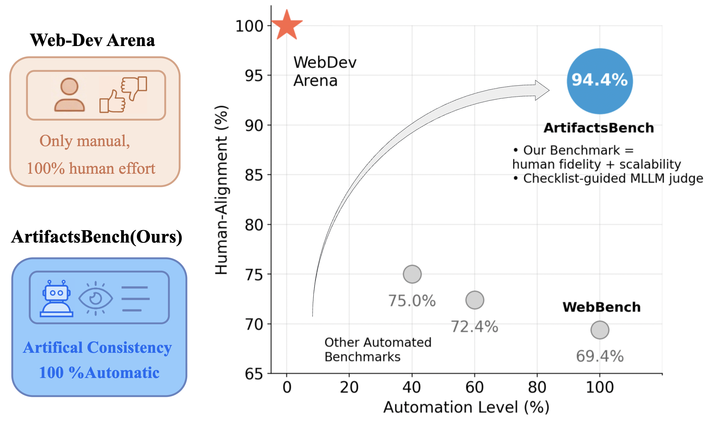
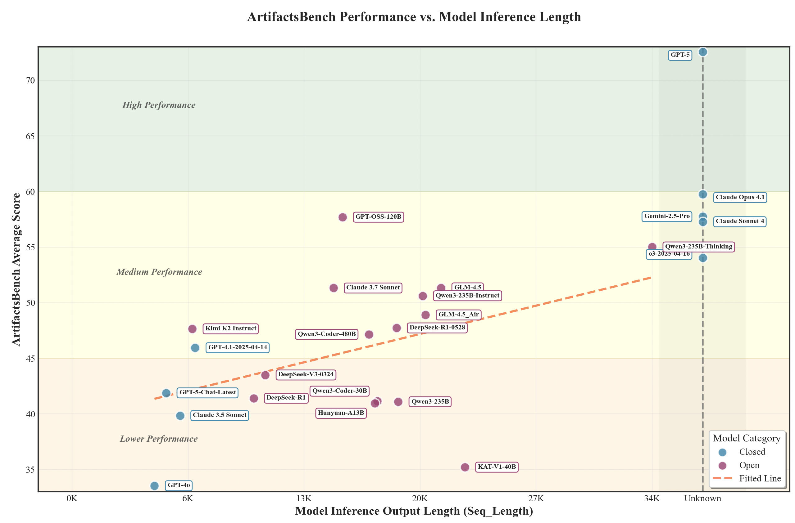
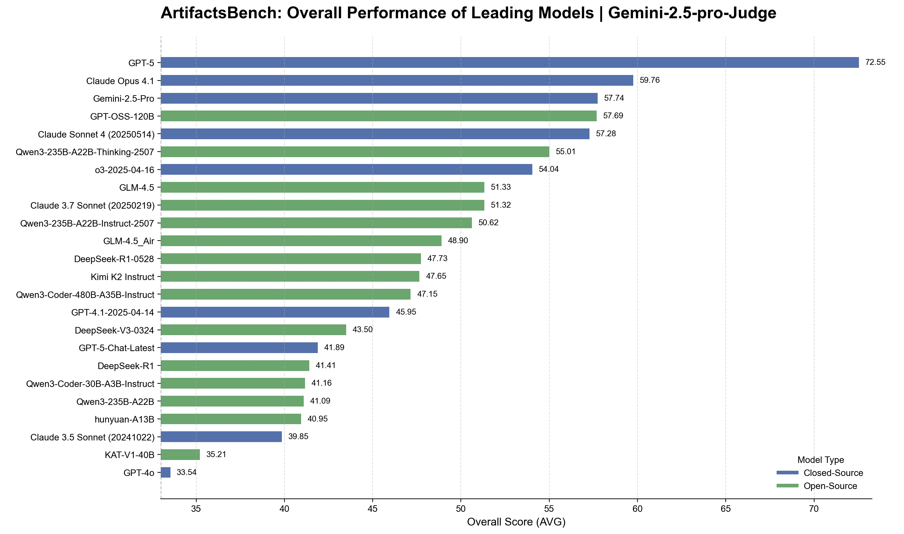
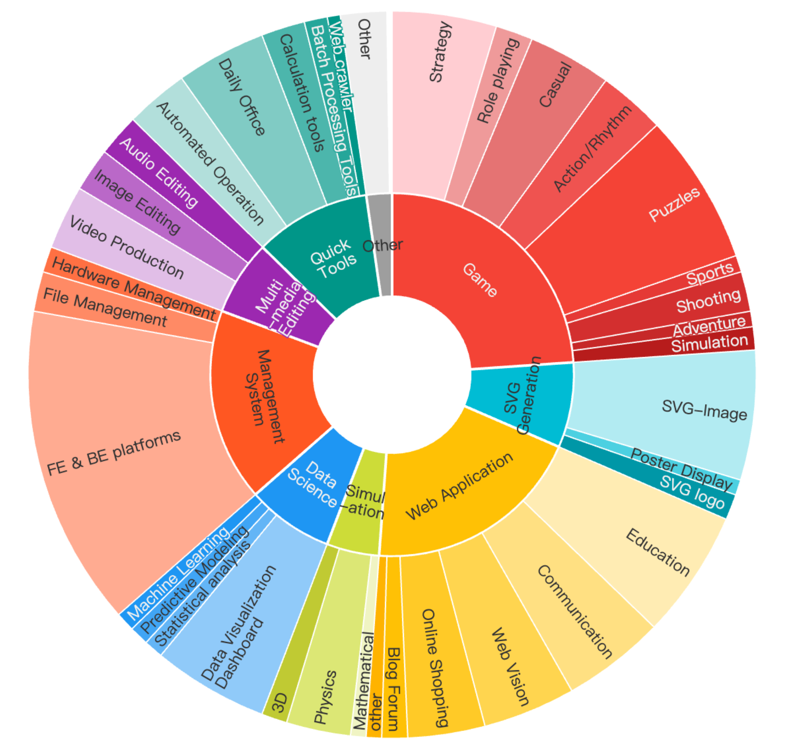
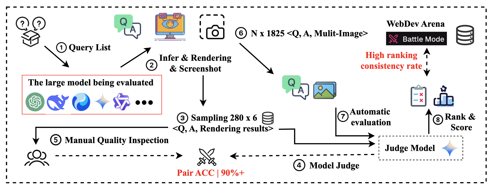
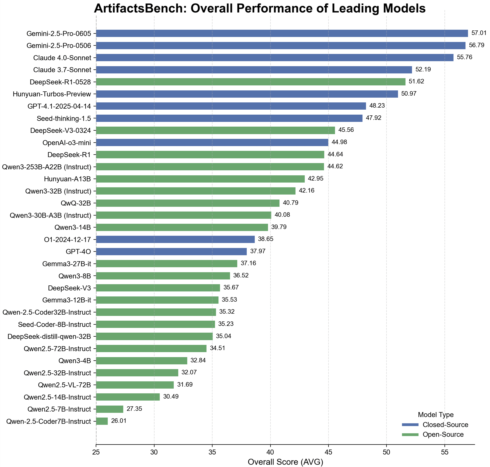

<div align='center'>

# ArtifactsBench: Bridging the Visual-Interactive Gap in LLM Code Generation Evaluation

**Tencent Hunyuan Team**

---

<p align="center">
    <a href="https://arxiv.org/abs/2507.04952">📖 Paper</a> •
    <a href="https://artifactsbenchmark.github.io/">🏠 Home Page</a> •
    <a href="https://huggingface.co/datasets/tencent/ArtifactsBenchmark/">💻 Data </a> •
    <a href="https://artifactsbenchmark.github.io/leaderboard.html">🏆 Leaderboard</a> •
    <a href="#citation"><b>📜 Citation</b></a>
</p>

<div align="center">
  
</div>
<p align="center">
  <i>Figure 1: Automation level versus human–alignment across evaluation frameworks. The red star marks the fully manual WebDev Arena (100% human effort), while the blue bubble denotes our checklist-guided MLLM evaluation, ArtifactsBench, which achieves 94.4% agreement with human votes with 100% automation.</i>
</p>
</div>

## Introduction

The generative capabilities of Large Language Models (LLMs) are rapidly expanding from static code to dynamic, interactive visual artifacts. This progress is bottlenecked by a critical evaluation gap: established benchmarks focus on algorithmic correctness and are blind to the visual fidelity and interactive integrity that define modern user experiences.

To bridge this gap, we introduce **ArtifactsBench**, a new benchmark and paradigm for the automated, multimodal evaluation of visual code generation. Our framework programmatically renders each generated artifact and captures its dynamic behavior, which is then assessed by an MLLM-as-Judge guided by a fine-grained, per-task checklist to ensure holistic and reproducible scoring.

ArtifactsBench is open-sourced, including the benchmark with **1,825 diverse tasks**, the evaluation harness, and baseline results, to provide the community with a scalable and accurate tool to accelerate the development of user-centric generative models.

## 🚀 Latest Updates & Release Notes

- 2025.10.27 | MiniMax-M2 — ArtifactsBench: 66.8 (DeepSeek‑V3.2: 55.8). 🎉🎉🎉 A compact MoE model (230B total parameters with 10B active) built for elite performance in coding and agentic tasks. Link: [MiniMax-M2 on Hugging Face](https://huggingface.co/MiniMaxAI/MiniMax-M2); GitHub: [MiniMax-M2](https://github.com/MiniMax-AI/MiniMax-M2). Scores per the report in the linked page.
- 2025.10.27 | JanusCoder (paper) — Releases JanusCode‑800K 🎉🎉🎉, a large-scale multimodal code corpus establishing a visual‑programmatic interface for code intelligence; reported improvements on ArtifactsBench: +3.0🎉 for Qwen3‑8B and +1.3🎉 for Qwen3‑14B, further expanding research on code visualization. Link: [arXiv:2510.23538](https://arxiv.org/abs/2510.23538).
- 2025.10.23 | ReLook (paper) — Vision‑grounded RL for agentic web coding: MLLM visual critic, zero‑reward for invalid renders, Forced Optimization, critic‑free inference; outperforms strong baselines. 🎉🎉🎉 Link: [arXiv:2510.11498](https://arxiv.org/abs/2510.11498).
- 2025.10.08 | Ling‑1T (1T) — ArtifactsBench: 59.31 (DeepSeek‑V3.1‑Terminus: 43.29). 🎉🎉🎉 Link: [Ling-1T model card](https://huggingface.co/inclusionAI/Ling-1T); Technical report: *"Every Activation Boosted: Scaling General Reasoner to 1 Trillion Open Language Foundation"* ([arXiv:2510.22115](https://arxiv.org/abs/2510.22115)). Scores per the report in the linked page.
- 2025.06.27 | Tencent Hunyuan-A13B — ArtifactsBench: 42.95. 🎉 An efficient MoE model with 13B active parameters (80B total) demonstrating strong performance in generating interactive visual artifacts while maintaining excellent resource efficiency. Link: [Hunyuan-A13B-Instruct](https://huggingface.co/tencent/Hunyuan-A13B-Instruct); Technical Report: [Hunyuan-A13B Technical Report](https://github.com/Tencent-Hunyuan/Hunyuan-A13B/blob/main/report/Hunyuan_A13B_Technical_Report.pdf).

### **Version 1.2 - August 9, 2025** 🔥🔥🔥

#### **Breakthrough Performance Updates:**

🚀 **Revolutionary Model Additions**: Added comprehensive evaluation of cutting-edge models including **GPT-5**, **GPT-OSS-120B**, and **Claude Opus 4.1**, representing the latest advances in AI code generation capabilities.

🏆 **Historic Achievements**: 
- **GPT-5** achieves an unprecedented **72.55** average score, setting a new benchmark record and establishing the new state-of-the-art for closed-source models
- **GPT-OSS-120B** secures the **#1 position among open-source models** with a remarkable **57.69** average score
- **Claude Opus 4.1** demonstrates significant advancement with **59.76** average score

💡 **OpenAI's Code Visualization Dominance**: The results showcase **OpenAI's exceptional capabilities in visual code generation**, with both GPT-5 and GPT-OSS-120B leading their respective categories and demonstrating superior understanding of interactive visual artifact creation.

📈 **Performance Insights**: Enhanced analysis reveals the relationship between model inference patterns and visual code generation quality, providing deeper insights into what makes models excel at creating interactive experiences.

#### **Key Highlights:**
- **First 70+ Score Achievement**: GPT-5 breaks the 70-point barrier, demonstrating quantum leap in visual artifact generation
- **Open-Source Leadership**: GPT-OSS-120B establishes new standards for open-source visual code generation
- **Cross-Category Excellence**: OpenAI models demonstrate consistent superiority across web applications, interactive games, and dynamic visualizations

### **Version 1.1 - July 30, 2025** 🔥🔥🔥

#### **Key Updates:**

🆕 **Model Coverage Expansion**: Added comprehensive evaluation of **GLM-4.5** to expand our coverage of state-of-the-art language models and provide more comprehensive benchmarking insights.

📊 **Enhanced Visualization**: Introduced a new analysis chart `artifactsbench_vs_model_infer.png` that visualizes the relationship between model inference scores and model response lengths, providing deeper insights into model behavior patterns.

### **Version 1.1 - July 25, 2025** 🔥🔥🔥

We're excited to announce important updates to ArtifactsBench that significantly improve reproducibility, expand model coverage, and enhance evaluation stability:

#### **Key Updates:**

🔧 **Unified Judge Model**: Migrated from Gemini-2.5-Pro-Preview-0605 (now deprecated) to the stable **Gemini-2.5-Pro** for all evaluations, ensuring consistent reproducibility for research communities.

🆕 **Expanded Model Coverage**: Added comprehensive evaluation of latest high-quality open-source code models to keep pace with rapid developments in the field.

📊 **Enhanced Transparency**: Released intermediate reasoning results and evaluation data to improve research confidence and full reproducibility.

#### **🎯 Full Open-Source & Complete Reproducibility:**

**🔓 100% Data Open-Source**: All evaluation data, model outputs, judge reasoning, and intermediate results are completely open-sourced - no proprietary data withheld.

**♻️ Complete Paper Reproducibility**: Every result in our paper can be fully reproduced using the provided data and scripts - we guarantee 100% reproducibility.

**🔍 Full Transparency**: From raw model outputs to final scores, every step of our evaluation pipeline is transparent and auditable.

#### **Data Release:**

All intermediate model results, judge model inference results, and reasoning chains from this update are available at `dataset/release_data_20250725/` for complete transparency and reproducibility.

#### **Updated Results Overview:**

<div align="center">
  
</div>
<p align="center">
  <i>Figure: Analysis of model inference scores versus response lengths on ArtifactsBench, revealing the relationship between model performance and output verbosity patterns.</i>
</p>

<div align="center">
  
</div>
<p align="center">
  <i>Figure: Latest ArtifactsBench results (July 2025) with expanded model coverage and unified Gemini-2.5-Pro evaluation.</i>
</p>

*For comparison, the previous results table is available in the [Leaderboard section](#-leaderboard).*

## Core Features

-   **A Diverse and Hierarchical Benchmark Suite:** ArtifactsBench comprises a rich set of tasks derived from real-world applications, including component-based web development, SVG-based data visualization, and interactive mini-games. Tasks are stratified by complexity (simple, medium, hard) to robustly measure model capabilities across a meaningful difficulty gradient.
-   **A Novel Multimodal and Automated Evaluation Pipeline:** We propose a new evaluation strategy that synergizes automated interaction with Multimodal Large Language Model (MLLM)-based assessment. Our framework renders each artifact and captures its behavior via temporal (three-step) screenshots. This visual evidence, alongside the source code, is then assessed by a Multimodal LLM (MLLM)-as-Judge guided by a fine-grained, per-task checklist to ensure holistic and reproducible scoring.
-   **In-depth Analysis and Gold-Standard Validation:** We conducted a large-scale evaluation of over 30 prominent LLMs. Our automated evaluation achieves a striking **94.4% ranking consistency with WebDev Arena**, the gold-standard for human preference, validating our approach as a highly reliable proxy for human-perceived quality.

## Benchmark Comparison

ArtifactsBench is the first to offer high-granularity evaluation (GR), strong human-judgment consistency (CHA), automated assessment (AF), and direct visual evaluation (VE), addressing critical gaps in prior work.

| **Benchmark**                  | **Data Size** | **Data Source**     | **Primary Task**                   | **GR**                               | **CHA**                              | **AF**       | **VE**       |
| ------------------------------ | ------------- | ------------------- | ---------------------------------- | ------------------------------------ | ------------------------------------ | :----------: | :----------: |
| Humaneval                      | 164           | Human-Written       | Algorithmic Tasks                  | <font color='gray'>Low</font>        | <font color='gray'>High</font>       |      ✓       |      ✗       |
| SWE-Bench                      | 2,294         | GitHub Issues       | Repository-level Bug Fixing        | <font color='gray'>Low</font>        | <font color='gray'>High</font>       |      ✓       |      ✗       |
| WebBench                       | 1,000         | Human-Written       | Web Task Automation                | <font color='orange'>Mid</font>      | <font color='orange'>Mid</font>      |      ✓       |      ✗       |
| WebGen-Bench                   | 101           | Human & GPT-4       | Web Page Generation                | <font color='orange'>Mid</font>      | <font color='orange'>Mid</font>      |      ✓       |      ✓       |
| WebChoreArena                  | 532           | Curated Tasks       | Web Automation (No UI)             | <font color='orange'>Mid</font>      | <font color='orange'>Mid</font>      |      ✓       |      ✗       |
| FullFront                      | 1,800 QA      | Model-Synthesized   | Web Comprehension/Generation       | <font color='orange'>Mid</font>      | <font color='orange'>Mid</font>      |      ✓       |      ✓       |
| WebDev Arena                   | N/A           | User-Prompts        | Web Design (Human Vote)            | <font color='gray'>Low</font>        | <font color='gray'>High</font>       |      ✗       |      ✓       |
| **ArtifactsBench (Ours)**      | **1,825**     | **Self-Constructed**  | **Interactive Visual Artifacts**   | <font color='green'><b>High</b></font> | <font color='green'><b>High</b></font> |      ✓       |      ✓       |

## Dataset Distribution

<div align="center">
  
</div>
<p align="center">
  <i>Figure 2: An overview of the ArtifactsBench dataset, illustrating the distribution of tasks across nine primary categories.</i>
</p>

## Evaluation Pipeline

Our evaluation process is designed to ensure objectivity and high consistency with human expert judgment.

<div align="center">
  
</div>
<p align="center">
  <i>Figure 3: The ArtifactsBench evaluation pipeline. The process hinges on a two-stage evaluation: (Step 5) we first validate our MLLM-as-Judge by confirming its high pairwise scoring agreement with human experts. (Step 6) Once its reliability is established, the automated judge is deployed at scale to evaluate all model outputs across the entire benchmark.</i>
</p>

## Quick Start

<details>
<summary><b>Environment Setup, Data Format, and Evaluation Instructions</b></summary>

### Environment Setup

```bash
pip install vllm==0.8.3
pip install pytest-playwright
playwright install
playwright install-deps
pip install transformers
pip install requests
pip install tqdm
```

### Data format
You can use your own model to perform inference based on the "question" field in the `dataset/artifacts_bench.json` file, and save the results in the "answer" field.
```JSON
{
  "index": "Unique identifier in the dataset that corresponds one-to-one with 'question'.",
  "question": "Each 'question' in ArtifactsBench.",
  "answer": "The answer inferred by your model based on the 'question'.",
  "checklist": "Array of evaluation criteria used by the MLLM judge (do not modify). Each item is an atomic check the judge will verify.",
  "class": "Category/type label for the sample",
  "difficulty": "Difficulty level of the sample, e.g., 'easy' | 'medium' | 'hard' (or a numeric scale)."
}
```

### Evaluation Using Gemini

```bash
api_key=xxx
model_marker=xxx
api_url=xxx
screenshots_count=3
path_with_index=xxx
save_path=xxx
screenshots_dir=xxx
tokenizer_dir=xxx
num_processes=16
python3 src/infer_gemini.py \
    $path_with_index \
    $save_path \
    $screenshots_dir \
    $screenshots_count \
    $api_key \
    $model_marker \
    $api_url \
    $tokenizer_dir \
    --num_processes $num_processes
```

#### Parameters Description
* **api\_key**: Your API key for accessing the Gemini model.
* **model\_marker**: The specific marker for the model to use in Gemini.
* **api\_url**: The URL endpoint for making the POST request to the server.
* **count**: The number of screenshots to feed into Gemini.
* **path\_with\_index**: The input file. Each entry in this file should include an 'index', 'question', and 'answer'.
* **save\_path**: The path where the results will be saved. Each entry will include two additional fields: `gemini_reason` (the explanation from Gemini) and `gemini_ans` (the score provided by Gemini).
* **screenshots\_dir**: The directory where the screenshots are stored.
* **tokenizer\_dir**: The directory for the tokenizer model, to prevent an excessive number of tokens.
* **num\_processes**: The number of processes to use for inference. For example, `16` processes.

### Evaluation Using Qwen2.5-VL-72B

```bash
# Deploy Qwen2.5-VL-72B-Instruct using vllm
MODEL_DIR="/xxx/Qwen2.5-VL-72B-Instruct"
HOST_IP=$(hostname -i)
model_name=$(basename $MODEL_DIR)
nohup python3 -m vllm.entrypoints.openai.api_server \
    --enforce-eager --swap-space 50 --disable-log-requests \
    --dtype float16 --trust-remote-code \
    --model ${MODEL_DIR} --served-model-name ${model_name} \
    --gpu-memory-utilization 0.9 --port 8088 \
    --max-model-len 32768 --max-seq-len 32768 \
    --limit-mm-per-prompt "image=5"\
    --tensor-parallel-size 8 \
    --seed 1024 > /root/log.ds_server 2> /root/err.ds_server &
sleep 10m

# Evaluate the answers with Qwen2.5-VL-72B-Instruct.
screenshots_count=3
path_with_index=xxx
save_path=xxx
screenshots_dir=xxx
tokenizer_dir=$MODEL_DIR
ip_file_path=$HOST_IP # ip or ip_list_file
num_processes=16
python3 src/infer_qvl.py \
  $path_with_index \
  $save_path \
  $screenshots_dir \
  $screenshots_count \
  $model_name \
  $tokenizer_dir \
  $ip_file_path \
  --num_processes $num_processes
```

#### Parameters Description
* **MODEL\_DIR**: The directory where the `Qwen2.5-VL-72B-Instruct` model is stored.
* **HOST\_IP**: The IP address of the host machine (obtained using `hostname -i`).
* **model\_name**: The name of the model (derived from the basename of `MODEL_DIR`).
* **screenshots\_count**: The number of screenshots to feed into Qwen2.5-VL-72B.
* **path\_with\_index**: The input file. Each entry should include an `index`, `question`, and `answer`.
* **save\_path**: The path where the results will be saved. Each entry will include two additional fields: `qvl_reason` (the explanation from Qwen2.5-VL-72B) and `qvl_ans` (the score provided by Qwen2.5-VL-72B).
* **screenshots\_dir**: The directory where the screenshots are stored.
* **tokenizer\_dir**: The directory for the tokenizer model, to prevent an excessive number of tokens.
* **ip\_file\_path**: The path to the file containing the IP addresses or IP list of the machines for distributed processing (e.g., `pssh.hosts`).
* **num\_processes**: The number of processes to use for inference (e.g., `16` processes).

</details>

## 🏆 Leaderboard

For the latest results, please visit the <a href="https://artifactsbenchmark.github.io/leaderboard.html">live leaderboard</a>.

### **Current Results (Version 1.2 - August 2025)**

The following are the latest results on ArtifactsBench, scored by the unified `Gemini-2.5-Pro` referee. A higher score indicates better overall capability in generating visual and interactive artifacts. This update showcases groundbreaking achievements with **GPT-5 setting a new benchmark record at 72.55** and **GPT-OSS-120B leading the open-source category**.

#### **Top Performing Models:**

| **Model** | **AVG** | **Category** | **Inference Length** | **Achievement** |
|-----------|---------|--------------|---------------------|-----------------|
| **GPT-5** | **72.55** | Closed | Unknown | 🥇 **New Benchmark Record** |
| **Claude Opus 4.1** | **59.76** | Closed | Unknown | 🥈 **Closed-Source #2** |
| **Gemini-2.5-Pro** | **57.74** | Closed | Unknown | 🥉 **Closed-Source #3** |
| **GPT-OSS-120B** | **57.69** | Open | 16,018 tokens | 🏆 **Open-Source Champion** |
| **Claude Sonnet 4** | **57.28** | Closed | Unknown | **Strong Performance** |
| **Qwen3-235B-Thinking** | **55.01** | Open | 34,357 tokens | **Open-Source #2** |

*Complete results visualization available in `figures/artifactsbench_vs_model_infer.png`*

### **Previous Results (Version 1.1)**

The following are the main results on ArtifactsBench from July 2025, scored by the unified `Gemini-2.5-Pro` referee.

<div align="center">
  
</div>

### **Previous Results (Version 1.0) - For Comparison**

The following were the original results on ArtifactsBench, scored by the `Gemini-2.5-Pro-0506` referee. These results are preserved for historical comparison and reproducibility studies.

<div align="center">
  
</div>

#### **Detailed Previous Results Table:**

| **Model**                 | **AVG** | **SV**  | **MMD** | **HD**  | **II**  | **GAME** | **SVG** | **WEB** | **SI**  | **MS**  |
| ------------------------ | :-----: | :-----: | :-----: | :-----: | :-----: | :------: | :-----: | :-----: | :-----: | :-----: |
| **_Closed-Source LLMs_** |         |         |         |         |         |          |         |         |         |         |
| Gemini-2.5-Pro-0605      | **57.01** | 59.99   | 56.35   | 58.13   | 54.87   | 55.21    | 61.78   | 58.30   | 55.03   | 55.03   |
| Gemini-2.5-Pro-0506      | **56.79** | 59.02   | 57.69   | 57.99   | 54.70   | 56.65    | 62.37   | 57.28   | 55.26   | 53.04   |
| Claude 4.0-Sonnet        | **55.76** | 57.14   | 59.18   | 57.93   | 53.04   | 57.22    | 56.98   | 55.79   | 56.67   | 53.20   |
| Claude 3.7-Sonnet        | **52.19** | 52.73   | 53.54   | 53.48   | 50.83   | 52.24    | 51.63   | 53.64   | 52.14   | 50.27   |
| Hunyuan-Turbos-Preview   | **50.97** | 50.58   | 53.27   | 53.08   | 49.35   | 51.61    | 51.37   | 52.31   | 50.74   | 49.92   |
| GPT-4.1-2025-04-14       | **48.23** | 47.90   | 48.68   | 49.61   | 47.39   | 50.43    | 48.75   | 48.51   | 46.88   | 42.81   |
| Seed-thinking-1.5        | **47.92** | 49.16   | 48.36   | 49.84   | 45.90   | 47.59    | 47.86   | 49.61   | 49.81   | 45.81   |
| OpenAI-o3-mini           | **44.98** | 46.49   | 45.11   | 46.04   | 43.45   | 45.43    | 46.82   | 45.18   | 43.91   | 41.73   |
| O1-2024-12-17            | **38.65** | 39.51   | 38.35   | 39.90   | 37.38   | 38.96    | 38.58   | 39.01   | 38.12   | 36.20   |
| GPT-4o                   | **37.97** | 40.60   | 37.74   | 40.32   | 35.04   | 36.96    | 39.54   | 39.27   | 35.73   | 35.83   |
| **_Open-Source LLMs_**   |         |         |         |         |         |          |         |         |         |         |
| DeepSeek-R1-0528         | **51.62** | 51.18   | 53.65   | 51.92   | 51.33   | 51.78    | 52.87   | 50.66   | 50.27   | 45.51   |
| DeepSeek-V3-0324         | **45.56** | 47.78   | 44.43   | 48.53   | 42.55   | 47.58    | 46.34   | 47.47   | 38.71   | 42.88   |
| DeepSeek-R1              | **44.64** | 47.17   | 46.75   | 46.95   | 41.44   | 44.18    | 47.01   | 45.58   | 41.85   | 42.40   |
| Qwen3-253B-A22B (Instruct) | **44.62** | 47.42   | 46.09   | 46.16   | 41.89   | 44.03    | 47.04   | 45.85   | 43.97   | 42.41   |
| Hunyuan-A13B             | **42.95** | 44.80   | 44.64   | 44.22   | 40.88   | 42.30    | 47.31   | 44.56   | 39.17   | 41.23   |
| Qwen3-32B (Instruct)     | **42.16** | 44.39   | 43.79   | 44.65   | 39.05   | 41.85    | 43.44   | 43.34   | 40.79   | 39.84   |
| QwQ-32B                  | **40.79** | 44.01   | 41.64   | 41.92   | 38.22   | 38.96    | 43.08   | 41.74   | 40.17   | 39.37   |

*   **SV**: Static Visual, **MMD**: Mild-to-Moderate Dynamics, **HD**: High Dynamics, **II**: Intensive Interactive
*   **GAME**: Game, **SVG**: SVG Generation, **WEB**: Web Application, **SI**: Simulation, **MS**: Management System
*   **AVG**: Global Average Score

<a id="citation"></a>
## Citation

If you find our project helpful, please cite:

```bibtex
@article{zhang2025artifactsbench,
  title={ArtifactsBench: Bridging the Visual-Interactive Gap in LLM Code Generation Evaluation},
  author={Zhang, Chenchen and Li, Yuhang and Xu, Can and Liu, Jiaheng and Liu, Ao and Hu, Shihui and Wu, Dengpeng and Huang, Guanhua and Li, Kejiao and Yi, Qi and others},
  journal={arXiv preprint arXiv:2507.04952},
  year={2025}
}
```

## Contributions

**First Authors** 
*   Chenchen Zhang, Tencent
*   Yuhang Li, Tencent

**Core Contributors** 
*   Can Xu, Tencent
*   Jiaheng Liu, NJU
*   Ao Liu, Tencent
*   Shihui Hu, Tencent

**Contributors | Algorithm Support (Alphabet Order)** 
*   Dengpeng Wu, Tencent
*   Guanhua Huang, Tencent
*   Kejiao Li, Tencent
*   Qi Yi, Tencent
*   Ruibin Xiong, Tencent
*   Haotian Zhu, Tencent
*   Yuanxing Zhang, PKU
*   Yuhao Jiang, Tencent
*   Yue Zhang, Tencent
*   Zenan Xu, Tencent

**Corresponding Authors** 
*   Wiggin Zhou, Tencent
*   Chayse Zhou, Tencent
*   Fengzong Lian, Tencent
*   `{wigginzhou,chaysezhou,faxonlian}@tencent.com`

**Acknowledgements | Data and Front-End Technical Support (Alphabet Order)** 
*   Bohui Zhai, Tencent
*   Guoxiang He, Tencent
*   Hebin Li, Tencent
*   Jie Zhao, Tencent
*   Le Zhang, Tencent
*   Lingyun Tan, Tencent
*   Pengyu Guo, Tencent
*   Xianshu Pang, Tencent
*   Yang Ruan, Tencent
*   Zhifeng Zhang, Tencent
*   Zhonghu Wang, Tencent
*   Ziyan Xu, Tencent
*   Zuopu Yin, Tencent


If you encounter any issues during testing, please contact adamwzhang@tencent.com.

## Data Availability & Reproducibility

**🔓 FULLY OPEN-SOURCE**: All intermediate evaluation results and reasoning data are completely open-sourced and available for download to ensure full reproducibility of our benchmark results. The updated evaluation pipeline with Gemini-2.5-Pro is fully automated and deterministic.

**📁 Data Location**: All intermediate model results and judge model inference results from the July 25, 2025 update are stored in `dataset/release_data_20250725/`, ensuring complete paper transparency and high reproducibility.

**🎯 100% Reproducibility Guarantee**: We provide complete reproducibility - every table, figure, and result in our paper can be fully reproduced using our open-sourced data and evaluation scripts.

For researchers interested in:
- **Reproducing our results**: All evaluation scripts and intermediate data are provided in `dataset/release_data_20250725/`
- **Extending the benchmark**: The framework is designed to easily accommodate new tasks and models
- **Comparing with custom models**: Use our standardized evaluation pipeline for consistent comparisons
- **Analyzing judge reasoning**: Access detailed judge model inference logs and reasoning chains
- **Verifying our claims**: Complete audit trail from raw outputs to final scores

## License

This repository is licensed under the terms of the [LICENSE](LICENSE) file.

